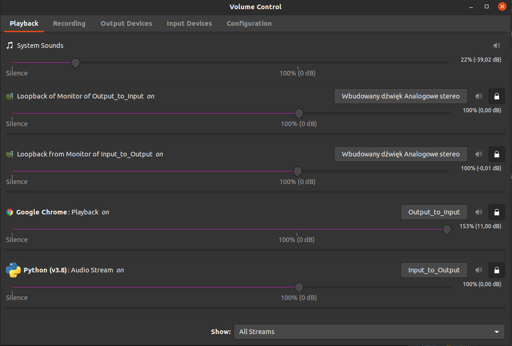
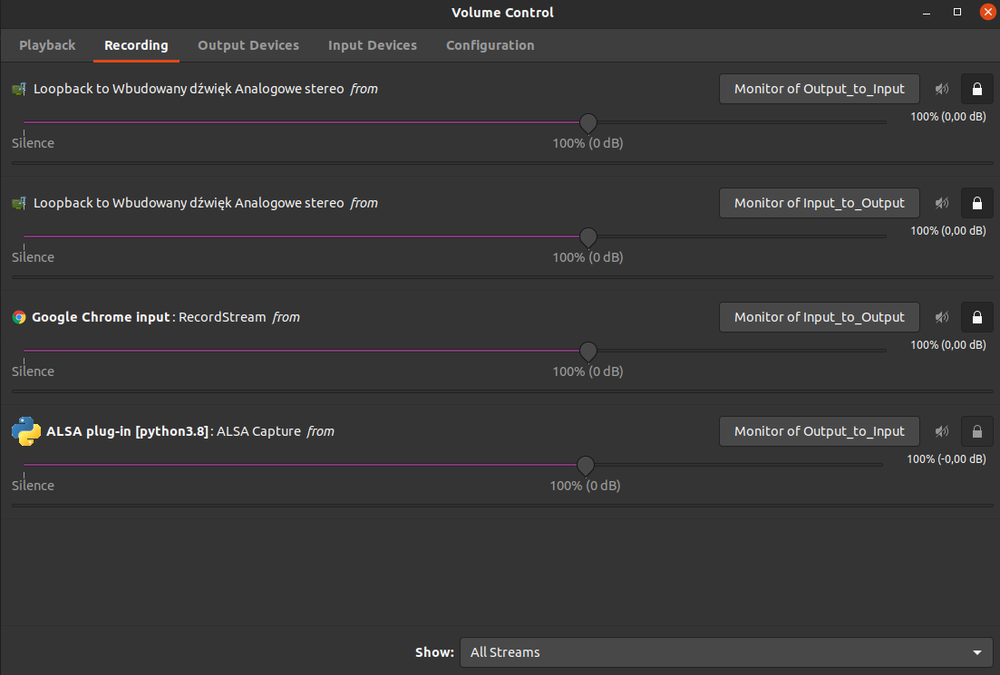

# Instruction

This code are using **python3** and **ubuntu**.
1. First you need pull code to your environment or something else method, but you must create **virtualenv**. I used PyCharm(Preferred).
- ```git pull https://github.com/Firemanpl/Teams-speech-recognition-audio-stream.git```
2. Install **python3-dev**:
- ```sudo apt-get install python3-dev```
3. Install ```requirements.txt``` :
- ```pip install requirements.txt```
4. Change view grid to list in settings on Teams:


5. Install **pulseaudio**. I used instruction from this link: https://www.youtube.com/watch?v=H4M1tn7LV8U
6. Create a virtual card in **pulseaudio**:
 - put below command to terminal:
  ```sudo gedit /etc/pulse/default.pa```
 - copy and paste these lines to ```deafult.pa```:
```
load-module module-null-sink sink_name=Output_to_Input sink_properties=device.description=Output_to_Input
load-module module-null-sink sink_name=Input_to_Output sink_properties=device.description=Input_to_Output
load-module module-loopback sink=Input_to_Output
load-module module-loopback sink=Output_to_Input
```
7. Enter your data to ```config.json```Set time to a one -two minute before example meeting time.You must remember about correct format time like that:```09:01``` instead ```9:1``` .Otherwise, you will get error in python console. Record your voice/voices and paste to your project folder. Then copy name your filename **your_example_voice.wav**. You can paste infinity voices to config.
   Files must be formatted .wav !!!
   At the end set your language. For example, if your language/dialect is British English, it is better to use "en-GB" as the language rather than "en-US":
```json
  {
    "email": "example@example.com",
    "password": "password",
    "current_members_less_than": 2,
    "teamname": "Test",
    "meetingtime": "22:10",
    "your_voice": ["record (2).wav" ,"record.wav","alert.wav"],
    "trigger_words": ["Json", "Manfreddy", "Stinky", "Rock", "example", "example", "example"],
    "language": "pl-PL"
  }
```
8. Start main.py: ```python3 main.py``` or green play sign in PyCharm. After run and join to online meeting say one with ```trigger_words```.
9. Go to **pulseaudio** and check setting like this:
```(You have repeat these action every time.)```





### (Optional, not tested) Pyaudio on Windows. 

 - ```pip install pipwin```

 - ```pipwin install pyaudio```

